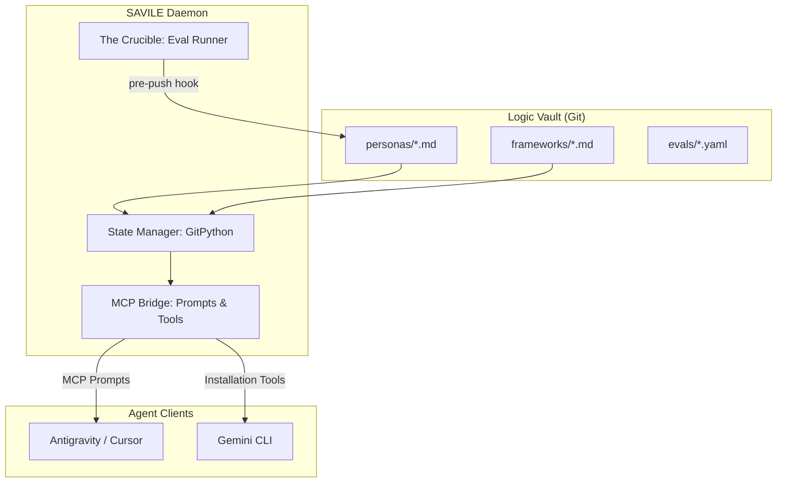

# SAVILE: The Git-Native Logic Bridge for AI Agents

[](https://www.python.org/downloads/release/python-3110/)
[](https://modelcontextprotocol.io/)
[](LICENSE)

**SAVILE** (System for Agentic Versioning, Intelligence, and Logical Evaluation) is a high-fidelity, local-first protocol for storing, versioning, syncing, and evaluating AI agent skills via the **Model Context Protocol (MCP)**.

Written strictly in Python, SAVILE bridges the gap between your version-controlled logic (Git) and your AI execution environments (Antigravity, Cursor, Claude Code).

---

## 🧐 Why SAVILE?

Modern AI development is plagued by opaque UI abstractions and "prompt drift." SAVILE treats your agent's "brain"—its personas, frameworks, and evaluations—as first-class code artifacts.

*   **Anti-Performative Software**: No web UI, no cloud lock-in. 100% local residency for logic and execution.
*   **Git-Native State**: Your intelligence isn't tethered to a single machine. Sync your logic vaults across teams using fundamental Git primitives.
*   **Deterministic Evaluation**: The **Crucible** ensures your logic actually works before you push it. If an assertion fails, the commit is rejected.

---

## 🏗️ System Architecture

SAVILE acts as a deterministic "Logic Router" that brings versioned clarity to the AI infrastructure layer.



---

## 🚀 Quick Start

### 1. Installation
```bash
# Clone and install locally
git clone git@github.com:mr8lu/savile.git
cd savile
python3 -m venv .venv
source .venv/bin/activate
pip install -e .
```

### 2. Initialize a Vault
Scaffold a new local vault or clone an existing one from a remote origin.
```bash
# Initialize a brand new local vault
savile init

# OR Initialize from a remote Git repository
savile init --source git+ssh://github.com/user/my-logic-vault.git
```

### 3. Serve to your IDE
Start the MCP server to broadcast your logic as dynamic slash-commands (Prompts).
```bash
savile serve
```

### 4. Enforce Quality
Install the pre-push Git hook to ensure your logic passes **The Crucible** evaluations before syncing.
```bash
savile install-hook
```

---

## 🛠️ Core Components

### The Registry Core
A standardized directory structure for your intelligence. Every persona and framework is a Markdown file with mandatory **YAML Frontmatter** for metadata tracking.

### The State Manager
Powered by `GitPython`, handling bidirectional synchronization between your local environment and remote logic origins.

### The MCP Bridge
Exposes your vault as **MCP Prompts** (for dynamic slash-command integration) and **Tools** (for physical file installation into `.agent/` or `.gemini/` directories).

### The Crucible
A validation loop that mathematically grades your logic against predefined thresholds in `/evals`.

---

## 🗺️ Roadmap

- **v0.1.0 (Infrastructure)**: ✅ Registry Core, Git sync, and basic MCP bridge.
- **v0.2.0 (The Crucible)**: ✅ Git hook integration, MCP Prompts, and Gemini CLI command generation.
- **v0.3.0 (The Protocol)**: 🚀 Remote module installation (`savile add`) and deterministic version pinning.

---

## 📄 License

MIT License. See [LICENSE](LICENSE) for details.

*Built with precision for the sovereign developer.*
