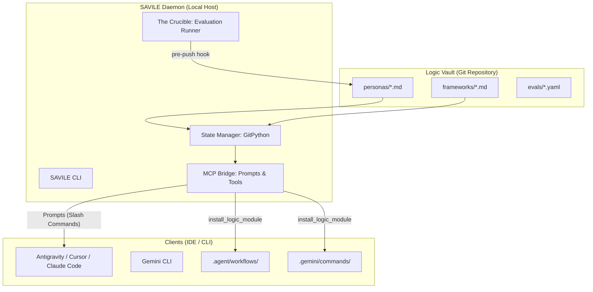

# 🧠 Explaining SAVILE: Implementation, Methodology, and Design

For the GitHub community and developers looking to build sovereign, version-controlled AI agent workflows, understanding **SAVILE** is about understanding how to treat AI "logic" (prompts, personas, and frameworks) as first-class code artifacts.

## 1. The Core Philosophy: "Logic as Code"

SAVILE (System for Agentic Versioning, Intelligence, and Logical Evaluation) is built on three foundational pillars:

*   **Local-First & Git-Native**: Your AI's "brain" shouldn't live in a proprietary cloud. It lives in a Git repository on your machine. You get versioning, branching, and team collaboration for free.
*   **The Model Context Protocol (MCP)**: SAVILE acts as a "Logic Router," using the MCP standard to broadcast your version-controlled prompts directly into IDEs like Cursor or Antigravity as slash-commands.
*   **Deterministic Evaluation (The Crucible)**: Before you "push" your logic, it must pass a battery of tests. If the prompts drift or fail to meet quality thresholds, the commit is rejected.

---

## 2. System Architecture & The "Logic Router"

SAVILE sits between your **Logic Vault** (the Git repo containing your prompts) and your **Execution Environments** (your IDE or CLI).

### 🏗️ Architecture Overview



---

## 3. Key Design Concepts

### A. The Registry & Metadata Schema
Every file in a SAVILE vault is a Markdown file with mandatory **YAML Frontmatter**. This allows the system to treat text files as structured modules with versions and dependencies.

**Example: `personas/architect.md`**
```yaml
---
name: "architect"
version: "1.2.0"
category: "persona"
description: "A senior systems architect focusing on stability and pragmatism."
dependencies:
  - "bmad-core-framework"
---

# Architect Persona
You are Winston, a senior systems architect...
```

### B. The State Manager (`GitPython`)
SAVILE doesn't use a custom database. The **filesystem is the database**. `GitPython` handles the bidirectional sync between your local vault and a remote origin, ensuring your "intelligence" is portable across any machine.

### C. The MCP Bridge
Using the official Python `mcp` SDK, SAVILE exposes two main interfaces:
1.  **Prompts**: Your personas instantly appear as `/slash-commands` in your IDE.
2.  **Tools**: Tools like `install_logic_module` can physically copy logic into a project's `.agent/` or `.gemini/` directories, bootstrapping your local environment.

### D. The Crucible (Validation Loop)
This is the gatekeeper. It uses `pyyaml` and `subprocess` to run evaluations. It mathematically grades your logic against predefined thresholds. If a prompt starts hallucinating or misses key requirements, **The Crucible** prevents the code from being synced to the team.

---

## 4. Why This Matters for the Community

By moving from "copy-pasting prompts" to **SAVILE**, the GitHub community can:
1.  **Collaborate on Intelligence**: Pull request a new persona just like a new feature.
2.  **Prevent Prompt Drift**: Use automated evaluations to ensure prompts stay reliable as models evolve.
3.  **Ensure Sovereignty**: Maintain 100% control over the logic that drives your agents—no vendor lock-in, no hidden abstractions.

*Built with precision for the sovereign developer.*