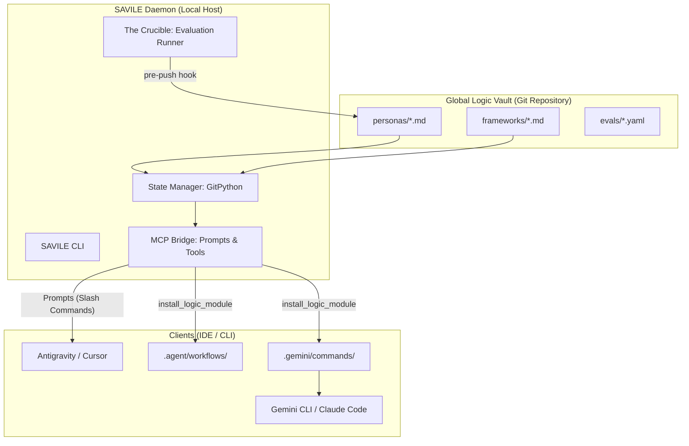

# Project Analysis: SAVILE
*System for Agentic Versioning, Intelligence, and Logical Evaluation*

## 1. Executive Overview
SAVILE is a high-fidelity, local-first protocol designed to bridge the gap between version-controlled AI logic (stored in Git) and the real-time execution environments of AI agents (IDEs and CLIs). It treats prompts, personas, and frameworks as first-class code artifacts, complete with metadata, validation, and automated synchronization.

## 2. System Architecture
Think of SAVILE as the "Logic Router" for your AI stack. It ensures that the same "brain" (persona) you use in your IDE is the same one used by your CLI tools, all while keeping a perfect history in Git.

## 3. Core Components

### 3.1 The Registry Core (The Brain)
The vault uses a standardized directory structure. Every module is a Markdown file enhanced with **YAML Frontmatter Metadata**.
*   **Location**: `/personas`, `/frameworks`, `/evals`.
*   **Standards**: Winston's Metadata Schema (v1.0.0) ensures every module declares its name, version, and dependencies.

### 3.2 The State Manager (The Heart)
Powered by `GitPython`, this component handles bidirectional synchronization.
*   **Git-Native**: Inherits branching, merging, and history for free.
*   **Safety**: Integrated `pre-push` hooks ensure no "broken" logic (failing evaluations) ever leaves the local machine.

### 3.3 The MCP Bridge (The Voice)
The Model Context Protocol (MCP) implementation that exposes the vault to the world.
*   **Zero-Install (Prompts)**: Dynamic broadcasting of vault modules as slash-commands (e.g., `/architect`).
*   **Physical-Install (Tools)**: The `install_logic_module` tool bootstraps local project directories for tools like Gemini CLI.

### 3.4 The Crucible (The Gatekeeper)
A validation runner that enforces both structural integrity (metadata checks) and logical density (LLM-graded assertions).

## 4. Implementation Status (v0.2.1)
As of March 28, 2026, SAVILE has successfully achieved:
- [x] Full Git-native sync engine.
- [x] MCP Prompt & Tool implementation.
- [x] Automated Gemini CLI command generation.
- [x] Built-in vault with 9 BMad core agents.
- [x] Pre-push evaluation hooks.
- [x] Automated BMAD pre-requisite linking and initialization scripting.
- [x] Adversarial security hardening for the MCP Server.
- [x] E2E CLI test suite and robust exception handling.

## 5. Next Horizon: v0.3.0 The Protocol
The next phase focuses on the "Network" effect:
*   **`savile add`**: Pulling remote modules from any repository.
*   **`savile.lock`**: Deterministic version pinning for team collaboration.
*   **Schema Enforcement**: Deep validation of the new metadata standards.
